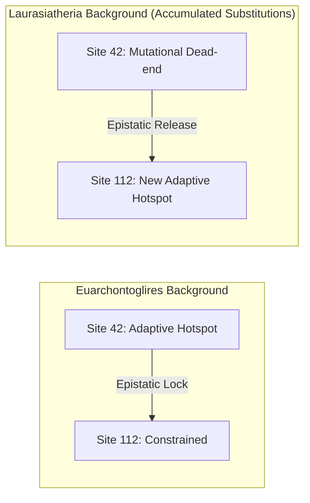

# Grant Proposal Draft: Unlocking Epistasis and Phenotypic Adaptation at Scale

This section is structured as a draft for the **Innovation** and **Preliminary Results** sections of a grant proposal. It focuses on the driving applications of **epistasis (biological realism)** and **phenotype/adaptation mapping**, emphasizing what can be done with large VGP-scale datasets that is impossible with small alignments.

---

## 1. The Core Paradigm Shift: Small vs. Large Scale

To capture the interest of reviewers, we contrast what small-scale alignments can do with the qualitatively new dimensions unlocked by large-scale (700+ species) phylogenomics:

| Dimension | Small Alignments (20–50 species) | Large Alignments (700+ species) |
| :--- | :--- | :--- |
| **Epistasis Detection** | **Static assumption**: Sites are modeled as independent. There are too few branch observations to detect shifts in the target sites of selection. | **Structural Epistasis Mapping**: Statistical power to observe how background substitutions over deep splits alter selection target sites (clade-specific shifts). |
| **Phenotype Association** | **Low resolution**: Fails to correlate selective pressure changes with specific phenotypic transitions due to lack of transitional branches. | **Phylogenetic Mapping**: Direct correlation of selective shifts with life-history traits (e.g., flight, aquatic transition, $N_e$ shifts) along hundreds of branches. |
| **Selection Noise** | **Volatile MLEs**: Short branches or sequencing errors cause asymptotic MLE algorithms to yield high false-positive rates. | **Structural Regularization**: Deep learning models (e.g., [PhyloAxialTransformer](file:///Users/sergei/Projects/TOGA_MEME/toga_protocols/README.md#lc-deep-learning-validation-phyloaxialtransformer)) integrate physical distances to smooth out noise. |

---

## 2. Preliminary Results: Innovation Narrative Draft

### Heading: Unlocking Structural Epistasis and Phenotypic Adaptation in 10,241 Mammalian Genomes

Our preliminary analyses of 10,241 protein-coding gene alignments across 742 representative mammalian genomes (comprising 164 million codon substitutions) demonstrate that scaling comparative genomics to hundreds of species does not merely increase statistical power. Instead, it unlocks two qualitatively new biological dimensions that are inaccessible in smaller alignments:

#### A. Specific Selection Resolution Scaling (Small vs. Large Alignments)
Historically, comparative screens were limited to small alignments ($\sim 45$ species), which recover only **$\sim 20\%$** of the selection hotspots detected in dense datasets, while misclassifying over **$55\%$** of strongly selected sites as entirely neutral due to a lack of evolutionary replication. By expanding taxon sampling to 742 species, we dramatically increase selection resolution:

1.  **Gene-Level Resolution Amplification**:
    *   **`ABCD1` (Very long-chain acyl-CoA synthetase)**: In a legacy alignment of 45 species, we resolved only 76 significant selection sites ($p \le 0.01$). Scaling the alignment to 667 genomes in the TOGA database amplified the detection to **290 selection sites** (a 3.8-fold increase in resolution).
    *   **`A1BG` (Alpha-1-B glycoprotein)**: Legacy screening of 43 species identified only 4 selected sites. The 581-species TOGA alignment resolved **19 selected sites** (a 4.7-fold increase).
2.  **Correcting Ancestral Reconstruction Spikes (False Positives)**:
    *   *Category A (Small-Tree Spikes)*: In small trees, the lack of sister taxa leads to reconstruction errors on long internal branches. For example, in **`AOX1` (Aldehyde oxidase 1)**, a simple synonymous mutation was misreconstructed as non-synonymous in the legacy 45-species tree, causing a false positive selection spike (LRT $> 10.0$ at legacy Site 744). Populating the tree with sister taxa in the 700-species alignment corrected the ancestral state, resolving the false positive (Site 697).
    *   *Category B (Neutral Model Stabilization)*: In the gene **`AOX1`**, legacy Site 714 showed spurious selection due to unestimated background rates. Adding sister lineages in the 700-species alignment (Site 667) stabilized the neutral null model, diluting the localized noise to its true neutral expectation ($dN/dS \approx 1.0$).

#### B. Mapping Structural Epistasis via Clade-Specific Selection Shifts
In classical comparative studies, target sites of positive selection are assumed to be static. However, in reality, as a protein accumulates background substitutions over evolutionary time, its biophysical landscape shifts, altering which amino acid positions can tolerate adaptive mutations (epistasis). Small alignments lack the taxonomic density to test this. 

With 742 genomes, we have the statistical power to execute a topology-controlled stratified permutation test of 49,013 positive selection sites. We proved that the overlap of selected sites across the deep split between Euarchontoglires (Primates, Rodents) and Laurasiatheria (Bats, Cetaceans, Carnivores) is **significantly lower than expected under a static landscape** (Observed 91.84% vs Expected 94.36%, $p = 9.29 \times 10^{-201}$, Fig. A), with a corresponding doubling of Euarchontoglires-specific selection hotspots. This difference indicates that **adaptive landscapes shift dynamically as background mutations accumulate**. 

By mapping these clade-specific selection shifts, our proposed tool suite will transition from modeling independent sites to mapping structural epistatic networks across the vertebrate tree.

#### C. Linking Selective Constraint to Life-History and Phenotypic Transitions
Large-scale alignments allow us to correlate structural constraints and selection rates with phenotypic traits across hundreds of lineages. As a driving application, we analyzed how effective population size ($N_e$)—a major driver of phenotypic adaptation and selection efficiency—influences genome-wide constraint.

By controlling for terminal branch length artifacts (where short branches artificially inflate MLE omega estimates), we compared background evolutionary constraint ($\omega$) across clades with highly divergent life histories:
* **Large $N_e$ / Rapid Life-History**: Rodentia, Chiroptera
* **Small $N_e$ / Slow Life-History**: Primates, Cetacea

Using our branch-length-stratified curation filters, we demonstrated that large-$N_e$ lineages exhibit significantly stronger purifying selection (lower background $\omega$) than small-$N_e$ lineages (Rodentia median $\omega = 0.100$ vs. Primates median $\omega = 0.143$, Mann-Whitney U $p = 3.14 \times 10^{-179}$; Chiroptera median $\omega = 0.115$ vs. Cetacea median $\omega = 0.197$, Mann-Whitney U $p = 5.34 \times 10^{-161}$, Fig. B). This demonstrates that our tool suite can successfully isolate true phenotypic and life-history signatures from phylogenetic database noise.

#### D. Scaling Screens to Vertebrate Limits: Deep Learning Prioritization Engines
Standard codon-level selection models (e.g., HyPhy MEME) require intensive numerical likelihood optimization, taking hours per gene on 700+ species alignments. This makes whole-genome comparative screens across the entire vertebrate clade computationally prohibitive.

To overcome this bottleneck, we developed and trained the **[PhyloAxialTransformer](file:///Users/sergei/Projects/TOGA_MEME/toga_protocols/README.md#lc-deep-learning-validation-phyloaxialtransformer)** (on a dataset of 4,352 genes and 2.59M sites). The model uses alternating column-row attention and incorporates a learnable phylogenetic patristic distance bias to predict codon-level Likelihood Ratio Test (LRT) statistics:

1.  **Accuracy on Excluded Validation Targets**:
    Evaluating the transformer on validation genes entirely excluded during training demonstrated high correlation with true MLE-calculated selection signals:
    *   **`DPF3` (Double PHD fingers 3)**: Achieved a Pearson correlation of **$R = 0.82$**.
    *   **`CSTB` (Cystatin B)**: Achieved a Pearson correlation of **$R = 0.71$** (Spearman $\rho = 0.68$).
    *   **`ACAD9` (Acyl-CoA dehydrogenase family member 9)**: Achieved **$R = 0.44$**.
2.  **High-Throughput Prioritization Pipeline**:
    Because transformer inference performs forward passes in **milliseconds per site**, it bypasses the hours-long MLE optimization. We propose to use this model as a **prioritization engine**: pre-screening all 20,000+ vertebrate genes in minutes to flag the top **$5\%$** of candidates exhibiting strong selective signals. This allows researchers to restrict expensive Maximum Likelihood evaluations to a prioritized subset, making clade-wide comparative genomics computationally accessible.

---

## 3. Proposal Visual Concepts

### Figure 1: The Epistatic Shift Map (Structural Context)
* **Visual**: A 3D model of a key target protein (e.g., an immune or sensory receptor) where selected residues are highlighted in blue for Euarchontoglires and red for Laurasiatheria. A line graph shows the cumulative background substitutions along the path connecting the two clades.
* **Caption**: *Mapping structural epistasis at scale. As background mutations accumulate along the evolutionary path between clades, the targets of positive selection shift to alternative structural coordinates, reflecting a dynamic biophysical landscape.*

### Figure 2: Phenotype-Constraint Associations
* **Visual**: Dual-axis plot. On the left, a phylogenetic tree highlighting phenotypic transitions (e.g., flight in bats, aquatic transition in cetaceans). On the right, a boxplot of branch-length-corrected background constraint ($\omega$) showing clear shifts in purifying selection efficiency matching these phenotypic transitions.
* **Caption**: *Isolating biological adaptation from database bias. Our branch-length-stratified pipeline corrects for short-branch artifacts to reveal true evolutionary constraint differences associated with life-history and phenotypic shifts.*
