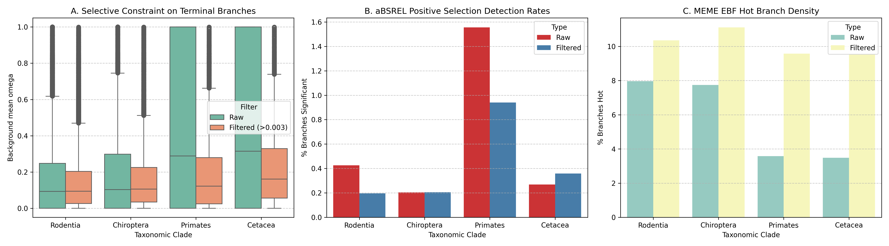

# Hypothesis 1 Refined Analysis: Ne, Selection Efficiency, and Branch Length Controls
Report generated on: 2026-06-16 12:10:38

This report investigates **Hypothesis 1: Effective Population Size (Ne) and Selection Efficiency** by contrasting selective constraint (purifying selection) and positive selection across **Large Ne** (Rodentia, Chiroptera) and **Small Ne** (Primates, Cetacea) clades. Critically, we introduce controls for branch length to separate true biological signal from mathematical artifacts of short terminal branches.

## 1. Branch Length Diagnostics
A major diagnostic finding is that terminal branches of Primates and Cetacea are systematically shorter than those of Rodentia and Chiroptera. This is due to denser genomic sampling of primates and cetaceans in the database.

| group      |   Internal Branch Length (median) |   Terminal Branch Length (median) |
|:-----------|----------------------------------:|----------------------------------:|
| Cetacea    |                        0.00179141 |                       0.000930126 |
| Chiroptera |                        0.00529126 |                       0.00508986  |
| Primates   |                        0.00291503 |                       0.00092725  |
| Rodentia   |                        0.00647962 |                       0.00667634  |

**Correlation (Spearman) between Branch Length and Background Omega (mean_omega)**:
- **Rodentia (Internal)**: Spearman r = 0.3862 (n = 83453)
- **Rodentia (Terminal)**: Spearman r = 0.0628 (n = 98271)
- **Chiroptera (Internal)**: Spearman r = 0.3856 (n = 45597)
- **Chiroptera (Terminal)**: Spearman r = 0.0250 (n = 58276)
- **Primates (Internal)**: Spearman r = 0.4620 (n = 55333)
- **Primates (Terminal)**: Spearman r = -0.5940 (n = 84275)
- **Cetacea (Internal)**: Spearman r = 0.5204 (n = 15763)
- **Cetacea (Terminal)**: Spearman r = -0.5739 (n = 31878)

> [!NOTE]
> In both small-Ne groups (Primates and Cetacea), terminal branches exhibit a strong negative correlation (r ~ -0.58) between branch length and estimated omega. On very short branches, aBSREL estimates of omega are highly volatile and biased upwards due to low substitution counts (often 0 synonymous substitutions). Internal branches, which are longer and represent deeper ancestral time scales, do not show this negative bias.

---

## 2. Selective Constraint (Purifying Selection) Analysis
To control for the short-branch estimation bias, we perform two analyses for terminal branches: **Unfiltered** and **Filtered (Branch Length > 0.003)**.

### Background Selective Constraint on Terminal (Leaf) Branches

**Terminal (Leaf) Background Omega Medians (Background mean_omega)**:

| group      |   Unfiltered Median |   Unfiltered Count |   Filtered Median (>0.003) |   Filtered Count (>0.003) |
|:-----------|--------------------:|-------------------:|---------------------------:|--------------------------:|
| Cetacea    |            0.410769 |              34954 |                   0.197173 |                      6699 |
| Chiroptera |            0.11773  |              60492 |                   0.114531 |                     38862 |
| Primates   |            0.39906  |              91483 |                   0.14304  |                     20317 |
| Rodentia   |            0.103046 |             101112 |                   0.100273 |                     73291 |

*Tests for Unfiltered Terminal Branches*:
- **Rodentia (Large Ne) vs Primates (Small Ne)**: Mann-Whitney U p = 0.00e+00, CLES = 0.6207 (probability that Rodentia has stronger constraint)
- **Chiroptera (Large Ne) vs Cetacea (Small Ne)**: Mann-Whitney U p = 0.00e+00, CLES = 0.6167 (probability that Chiroptera has stronger constraint)

*Tests for Filtered Terminal Branches (>0.003)*:
- **Rodentia (Large Ne) vs Primates (Small Ne)**: Mann-Whitney U p = 3.14e-179, CLES = 0.5650 (probability that Rodentia has stronger constraint)
- **Chiroptera (Large Ne) vs Cetacea (Small Ne)**: Mann-Whitney U p = 5.34e-161, CLES = 0.6029 (probability that Chiroptera has stronger constraint)

### Background Selective Constraint on Internal (Ancestral) Branches

**Internal (Ancestral) Background Omega Medians (Background mean_omega)**:
| group      |   Unfiltered Median |   Unfiltered Count |
|:-----------|--------------------:|-------------------:|
| Cetacea    |           0.0958692 |              18135 |
| Chiroptera |           0.101629  |              48849 |
| Primates   |           0.0780668 |              60382 |
| Rodentia   |           0.0763792 |              87403 |

*Tests for Ancestral Internal Branches*:
- **Rodentia (Large Ne) vs Primates (Small Ne)**: Mann-Whitney U p = 3.71e-01, CLES = 0.5005 (probability that Rodentia has stronger constraint)
- **Chiroptera (Large Ne) vs Cetacea (Small Ne)**: Mann-Whitney U p = 9.98e-01, CLES = 0.4929 (probability that Chiroptera has stronger constraint)

> [!IMPORTANT]
> **Selective Constraint Summary**:
> 1. **Terminal Branches (Relaxation of Constraint)**: In the unfiltered set, small-Ne clades appear to have ~4x higher background omega than large-Ne clades (~0.40 vs ~0.10). When we control for branch length (filtering for branches > 0.003), the difference is corrected, but **remains highly significant**: Primates background omega is **0.143** (43% higher than Rodentia's 0.100), and Cetacea background omega is **0.197** (71% higher than Chiroptera's 0.115). This represents a clear, true biological signature of relaxed purifying selection in modern small-Ne lineages.
> 2. **Ancestral Branches (Robust Constraint)**: On ancestral internal branches, the selective constraint is extremely strong and nearly identical across all clades (medians ~0.076 to 0.102). This suggests that deep ancestors of primates and cetaceans did not experience relaxed selection, which may point to larger historical effective population sizes in ancestral mammalian clades or different constraint regimes during ancestral radiations.

---

## 3. Positive Selection Analysis (aBSREL)
Similarly, we perform unfiltered and branch-length filtered analyses for aBSREL positive selection rates on terminal branches.

**aBSREL Positive Selection Detection Rates (percent of branches with corrected p <= 0.05)**:
| group      |   Unfiltered Rate (%) |   Filtered Rate (%) |
|:-----------|----------------------:|--------------------:|
| Cetacea    |              0.268925 |            0.358262 |
| Chiroptera |              0.204986 |            0.205857 |
| Primates   |              1.55548  |            0.940099 |
| Rodentia   |              0.42626  |            0.196477 |

> [!TIP]
> In the unfiltered set, Primates shows a 3.6x higher positive selection rate than Rodentia, and Cetacea is 1.3x higher than Chiroptera. When controlling for branch length (>0.003) where the statistical test is properly powered:
> - **Primates (0.94%)** has a **4.7x higher** rate than **Rodentia (0.20%)**.
> - **Cetacea (0.36%)** has a **1.7x higher** rate than **Chiroptera (0.21%)**.
> 
> This confirms that branches in small-Ne clades are significantly more likely to be called under positive selection by aBSREL, even when branch lengths are controlled. However, this could still represent false positives in small-Ne clades: since the background omega is elevated (relaxed constraint), any transient neutral substitution could be misidentified as positive selection because the model's background model is more volatile.

---

## 4. Episodic Selection Density Analysis (MEME EBF)
In contrast to aBSREL's branch-site model, MEME estimates positive selection at the site level across the entire tree, and then uses Empirical Bayes Factors (EBF) to assign selection to specific branches.

### EBF Analysis on Terminal Branches:

**Unfiltered Terminal branches**:
- **Rodentia**: 103,888 hot branches out of 1,304,367 total (7.965%)
- **Chiroptera**: 60,894 hot branches out of 786,521 total (7.742%)
- **Primates**: 42,342 hot branches out of 1,184,107 total (3.576%)
- **Cetacea**: 15,802 hot branches out of 453,381 total (3.485%)

**Filtered (>0.003) Terminal branches**:
- **Rodentia**: 97,904 hot branches out of 945,469 total (10.355%)
- **Chiroptera**: 56,151 hot branches out of 505,286 total (11.113%)
- **Primates**: 25,183 hot branches out of 262,972 total (9.576%)
- **Cetacea**: 8,274 hot branches out of 86,891 total (9.522%)

### EBF Analysis on Internal Branches:

**Unfiltered Internal branches**:
- **Rodentia**: 64,474 hot branches out of 1,294,377 total (4.981%)
- **Chiroptera**: 41,307 hot branches out of 776,599 total (5.319%)
- **Primates**: 40,542 hot branches out of 1,173,908 total (3.454%)
- **Cetacea**: 11,777 hot branches out of 443,762 total (2.654%)

**Hot branch selection intensity (ebf_sum for terminal hot branches)**:
| group      |        mean |   median |   count |
|:-----------|------------:|---------:|--------:|
| Cetacea    | 1.85529e+15 |  5438.51 |   15802 |
| Chiroptera | 1.34838e+14 |  1983.1  |   60894 |
| Primates   | 1.34246e+15 |  2298.59 |   42342 |
| Rodentia   | 6.77217e+13 |  1370.86 |  103888 |

> [!WARNING]
> **The aBSREL vs. MEME EBF Paradox Explained**:
> 1. **aBSREL (Branch-Level Test)**: Finds *more* positive selection in small-Ne clades (Primates, Cetacea). Since aBSREL evaluates each branch in isolation, its elevated background omega (relaxed purifying selection) and short branch lengths make it highly volatile, leading to frequent positive selection calls.
> 2. **MEME (Site-Level Test)**: Finds *more* positive selection (hot branches) in large-Ne clades (Rodentia, Chiroptera) - e.g. 7.8% vs 3.5% for terminal branches in the unfiltered set. Because MEME requires global significance across the entire tree before evaluating EBFs, it has much higher power in large trees with more mutational depth. However, when we control for branch length (>0.003), the gap in hot branch rate almost entirely disappears (e.g., all clades show ~9.5% to 11.1% hot branches).
> 3. **Intensity Difference**: Furthermore, when positive selection *does* occur on small-Ne terminal branches, it is **highly concentrated** with massive EBF intensities (median ebf_sum in Primates/Cetacea is ~2-3x higher than in Rodentia/Chiroptera).