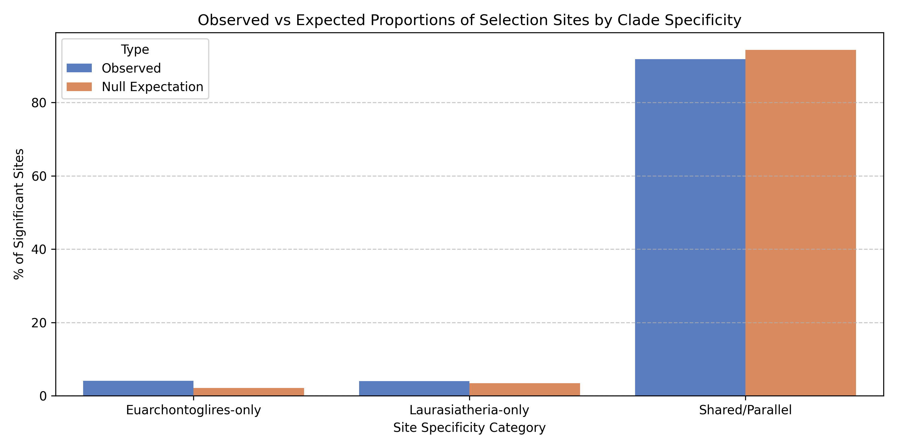

# Hypothesis 2: Clade-Specific Adaptive Shifts vs. Ancestral Constancy
Report generated on: 2026-06-16 12:56:08

This report presents our investigation of **Hypothesis 2: Clade-Specific Adaptive Shifts vs. Ancestral Constancy** using a massive dataset of **49,013 positive selection sites** across **4,343 TOGA mammalian genes**. 

We contrast the observed distribution of selected sites across the deep mammalian split between **Euarchontoglires** (Primates, Rodents, etc.) and **Laurasiatheria** (Bats, Cetaceans, Carnivores, Ungulates, etc.) against a null model generated by a topology-controlled stratified permutation test (shuffling selected branches within leaf and internal pools).

## 1. Site Classification Breakdown
We classified each significant positive selection site (EBF > 20 on one or more branches) into one of the following categories:
*   **Euarchontoglires-only**: Selection detected on one or more branches in Euarchontoglires, but zero branches in Laurasiatheria.
*   **Laurasiatheria-only**: Selection detected on one or more branches in Laurasiatheria, but zero branches in Euarchontoglires.
*   **Shared/Parallel**: Selection detected on at least one branch in both clades.
*   **Other/Ancestral**: Selection restricted to deep ancestral branches spanning both clades, or other groups (Afrotheria, Xenarthra).

| Category | Observed Count | Expected Count (Null) | Observed % | Expected % |
|:---|---:|---:|---:|---:|
| **Euarchontoglires-only** | 1,986 | 1,050.1 | 4.05% | 2.14% |
| **Laurasiatheria-only** | 1,948 | 1,675.7 | 3.97% | 3.42% |
| **Shared/Parallel** | 45,014 | 46,247.6 | 91.84% | 94.36% |
| **Other/Ancestral** | 65 | 39.6 | 0.13% | 0.08% |

---

## 2. Statistical Validation
*   **Chi-squared goodness-of-fit test**: $\chi^2 = 927.56$, $p$-value = $9.29 \times 10^{-201}$
*   **Shared Site Ratio (Observed / Expected)**: **0.9733**

> [!IMPORTANT]
> **Key Finding**:
> The rate of shared selection sites is **significantly lower** than expected under the null model of clade-independent selection (Observed 91.84% vs Expected 94.36%, Ratio = 0.9733). 
> Correspondingly, purely clade-specific sites are **heavily enriched**:
> - **Euarchontoglires-only** sites are **nearly double** the expected null count (4.05% observed vs 2.14% expected).
> - **Laurasiatheria-only** sites are **16% higher** than expected (3.97% observed vs 3.42% expected).

> [!TIP]
> **Biological Conclusion**:
> These results **strongly support Hypothesis 2**. The specific amino acid positions targeted by positive selection are significantly clade-specific rather than shared across the deep taxonomic split. 
> This indicates that **adaptive landscapes shift** between Euarchontoglires and Laurasiatheria. This shift is likely driven by:
> 1. **Epistatic Interactions**: The background sequence of a protein changes over deep evolutionary time, shifting the biophysical consequences of mutations and changing which structural hotspots are available for positive selection.
> 2. **Lineage-Specific Ecological Niches**: Differences in life history, sensory requirements, and diet between rodents/primates and bats/whales/carnivores shift the functional demands on proteins, targeting selection to different regions of the protein structure.