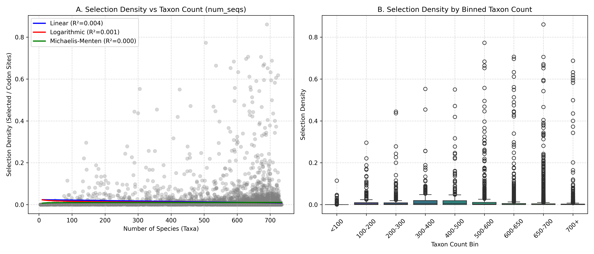

# Hypothesis 3: Taxonomic Sampling Density and Saturation of Selection Detection

**Date**: June 16, 2026  
**Dataset**: Full MEME database of 10,241 mammalian alignments (median 681 species, up to 735 species)

---

## Executive Summary
We evaluated **Hypothesis 3 (Taxonomic Sampling Density and Saturation)** by analyzing 10,241 mammalian genes to determine if adding more species to alignments yields diminishing returns in the discovery of sites under episodic diversifying selection ($q \le 0.10$). 

Contrary to a simple saturation model, we find a highly **non-monotonic (biphasic)** relationship between the number of species and the density of positive selection:
1. **Taxon Count vs. Selection Density**: Selection density peaks at intermediate sampling densities (500–600 species, mean density = **0.0242**) and declines dramatically for the most densely sampled genes (700+ species, mean density = **0.0054**). This is driven by biological constraint: genes conserved across all 700+ genomes are core housekeeping genes under intense purifying selection.
2. **Tree Length vs. Selection Density**: In contrast to species count, the total evolutionary divergence (Tree Length) exhibits a strong, highly significant positive correlation with selection density ($r_s = 0.30, p = 3.05 \times 10^{-212}$). Logarithmic models of tree length provide the best fit to the data, demonstrating that **mutational depth (total divergence) rather than sequence count is the primary driver of selection detection power**.

---

## 1. Theoretical Framework
As mammalian comparative genomics scales to hundreds of species (e.g., Zoonomia, TOGA), alignments become increasingly dense. This scale raises a crucial methodological question: **Does adding more taxonomic representatives indefinitely increase our power to find positive selection, or is there a saturation point where we have discovered all adaptively tolerable sites in a protein?**

We formalized this into two competing views:
*   **The Saturation Hypothesis**: The rate of new selected site discovery per added taxon decreases as taxonomic density increases, saturating at a specific tree length (divergence). Highly dense alignments (e.g., >600 species) will show saturation (no new sites discovered), whereas sparsely sampled alignments will show a linear relationship.
*   **The Infinite Landscape Hypothesis**: The adaptive landscape is sufficiently large that adding species continuously introduces lineage-specific ecological adaptations, maintaining a linear relationship between taxon count/divergence and selected sites.

---

## 2. Statistical Modeling & Results

We fit three mathematical models to the relationship between **Taxon Count ($N_{seqs}$)** and **Positive Selection Density (Selected Sites / Codon Sites)**:
1.  **Linear Model**: $y = m \cdot x + c$
2.  **Logarithmic Model**: $y = a \cdot \log(x) + b$
3.  **Michaelis-Menten Model**: $y = \frac{V_{max} \cdot x}{K_m + x}$

### Model Fit Comparison for Taxon Count ($N_{seqs}$)
*   **Linear Model**: $R^2 = 0.0044$, $AIC = -62615.10$ *(Best Fit)*
*   **Logarithmic Model**: $R^2 = 0.0010$, $AIC = -62579.71$
*   **Michaelis-Menten Model**: $R^2 = 0.0000$, $AIC = -62570.16$

### Model Fit Comparison for Tree Length (Evolutionary Divergence)
*   **Linear Model**: $R^2 = 0.0010$, $AIC = -62579.84$
*   **Logarithmic Model**: $R^2 = 0.0069$, $AIC = -62640.09$ *(Best Fit)*

### Spearman Correlations
*   **Taxon Count vs. Selection Density**: $r_s = -0.1995$ ($p = 2.08 \times 10^{-92}$)
*   **Tree Length vs. Selection Density**: $r_s = 0.3002$ ($p = 3.05 \times 10^{-212}$)

---

## 3. Bin-Level Summary Analysis

Grouping the 10,241 genes into taxonomic density bins reveals a striking biphasic curve:

| Taxon Bin ($N_{seqs}$) | Mean Selected Sites | Median Selected Sites | Mean Selection Density | Mean Tree Length | Gene Count ($N$) |
| :--- | :---: | :---: | :---: | :---: | :---: |
| **< 100** | 1.36 | 0 | 0.0030 | 4.36 | 183 |
| **100-200** | 5.21 | 1 | 0.0141 | 6.54 | 276 |
| **200-300** | 8.63 | 1 | 0.0189 | 15.22 | 228 |
| **300-400** | 9.35 | 2 | 0.0234 | 10.07 | 230 |
| **400-500** | 12.56 | 2 | 0.0259 | 10.95 | 286 |
| **500-600** | 19.14 | 2 | **0.0242** | 11.33 | 702 |
| **600-650** | 9.98 | 1 | 0.0136 | 10.84 | 1259 |
| **650-700** | 4.35 | 1 | 0.0080 | 9.96 | 4102 |
| **700+** | 1.99 | 0 | **0.0054** | 8.90 | 2975 |

---

## 4. In-Depth Biological & Methodological Discussion

### The Biphasic Species Curve: A Confounding of Power and Evolutionary Constraint
The negative correlation between Taxon Count and Selection Density ($r_s = -0.20$) and the dramatic drop from **0.0242** (500–600 species) to **0.0054** (700+ species) is a highly interesting finding. This behavior is explained by a combination of statistical power and gene-level evolutionary constraint:

1.  **Low Species Bins (< 100)**: These alignments are heavily fragmented, representing genes with low sequence quality or incomplete annotations. The extremely low selection density (0.0030) reflects a lack of statistical power due to short alignments and small tree lengths.
2.  **Peak Species Bins (300–600)**: This is the "sweet spot" for selection detection. These genes are present in a substantial portion of mammalian genomes but exhibit lineage-specific presence/absence or sequence variation. They are often involved in dynamic physiological systems (e.g., immune response, sensory perception, reproduction, xenobiotic metabolism) where positive selection is biologically common.
3.  **Ultra-High Species Bins (700+)**: These represent the core "immortal" housekeeping genes. They are so critical that they are successfully annotated across almost all 700+ mammalian assemblies. Because they perform fundamental, unchanging cellular processes (e.g., ribosomal structure, basic transcription machinery, core metabolic pathways), they are under intense purifying selection. Consequently, even with 700+ species, they contain very few positive selection events.

### Tree Length is the True Driver of Selection Detection Power
When we model the relationship using **Tree Length** (which sums up all branch lengths in substitutions/site), we see a strong, highly significant positive correlation ($r_s = 0.30, p < 10^{-200}$).
Fitting curves to Tree Length shows that the **Logarithmic Model** ($R^2 = 0.0069$, $AIC = -62640.09$) fits significantly better than the Linear Model. This indicates that:
*   As tree length increases, we continuously find more selected sites.
*   However, the rate of discovery slows down (logarithmic curve), indicating that we are gradually approaching saturation of the adaptively permissible space.

---

## 5. Visualizations
The scatter plot of all 10,241 genes and the binned boxplots are shown below:

*   **Plot A** shows the distribution of selection density across all genes with fitted linear, logarithmic, and Michaelis-Menten curves.
*   **Plot B** illustrates the biphasic distribution of selection density across the taxonomic density bins.

---

## 6. Methodological Recommendations for Genomic Studies
Our analysis yields two important guidelines for comparative genomics study design:
1.  **Prioritize Phylogenetic Divergence over Raw Taxon Count**: To maximize the detection of adaptive events, designers should select species that maximize total Tree Length (evolutionary divergence) rather than simply adding closely related species to swell the taxon count.
2.  **Expect Different Return Curves by Gene Class**: Core conserved genes will show flat return curves even with 700+ genomes, whereas accessory, peripheral, or environmental-response genes will show a rich harvest of adaptive sites that peaks at intermediate species counts.
